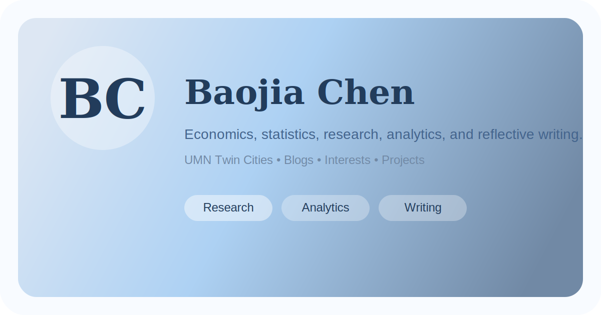

# Baojia Chen Personal Site

Personal website and GitHub Pages portfolio for Baojia "Bonita" Chen.

[](https://bonita-chen.github.io/)
[](https://github.com/Bonita-Chen/Bonita-Chen.github.io/actions)
[](https://github.com/Bonita-Chen/Bonita-Chen.github.io/actions)
[](./LICENSE)

Built with [Next.js](https://nextjs.org/), [React](https://react.dev/), [TypeScript](https://www.typescriptlang.org/), and [Tailwind CSS](https://tailwindcss.com/), then exported as a static site for GitHub Pages.

**Live site:** [bonita-chen.github.io](https://bonita-chen.github.io/)



## About This Site

This project is a GitHub Pages portfolio for Baojia Chen, adapted from the structure of `mldangelo/personal-site` and visually tuned against the local `index.html` reference. The site combines resume content, markdown-based blog writing, interest tracking, and project storytelling in a static-first setup that is easy to maintain over time.

The content model is intentionally simple: structured TypeScript files for stable profile data, markdown for blog posts, and a GitHub-native `/admin/` page that supports draft editing for About, Blogs, and Interests before exporting the real repository files.

## What Is Included

- About page
- Resume page
- Blogs with tag filters and collections
- Interests timeline with progress estimates and linked detail cards
- Projects page
- Contact page
- `/admin` visual editing studio for About, Blogs, and Interests

## Tech Stack

- Next.js 16 App Router
- React 19
- TypeScript
- Tailwind CSS v4
- Markdown-based blog posts
- GitHub Actions deployment to GitHub Pages

## Local Development

```bash
npm install
npm run dev
```

Open [http://localhost:3000](http://localhost:3000).

## Common Commands

```bash
npm run dev          # Start local development server
npm run build        # Create static production export
npm run type-check   # Run TypeScript checks
npm run lint         # Run Biome checks
npm run format       # Format source files
npm test             # Run test suite
```

## Editing Content

The main site content lives in a few predictable places:

- Homepage hero: `src/components/Template/Hero.tsx`
- About page copy: `src/data/about.ts`
- Resume experience and subtitles: `src/data/resume/work.ts`
- Resume education and honors: `src/data/resume/degrees.ts`
- Resume skills: `src/data/resume/skills.ts`
- Resume courses: `src/data/resume/courses.ts`
- Projects: `src/data/projects.ts`
- Interests timeline: `src/data/interests.ts`
- Contact links: `src/data/contact.ts`
- Footer and copyright: `src/components/Template/Footer.tsx`
- Blog posts: `content/blogs/*.md`

After deployment, the site also exposes an `/admin/` page that links directly to the matching GitHub edit screens. This keeps editing inside GitHub and avoids storing passwords or secrets in the browser.

## Deployment

This repository is configured for GitHub Pages.

- Static export is enabled in `next.config.ts`
- GitHub Pages deploys automatically from the `main` branch through GitHub Actions
- Build output is generated into `out/`
- Pages source should be set to `GitHub Actions`

To deploy:

1. Push the source code to `main`
2. Wait for the `CI` and `Deploy to GitHub Pages` workflows to finish
3. Visit the GitHub Pages URL

## Admin and Repo Slug

The `/admin/` page builds GitHub edit links from the repository slug.

It reads the slug from:

1. `NEXT_PUBLIC_GITHUB_REPO_SLUG`, if set
2. `GITHUB_REPOSITORY`, if available in GitHub Actions
3. `package.json` repository URL as the fallback

The current repository is expected to be:

```text
Bonita-Chen/Bonita-Chen.github.io
```

## Credits

- Based on Michael D'Angelo's [personal-site](https://github.com/mldangelo/personal-site)
- Visual direction adapted for Baojia Chen, with inspiration from Jingcheng Liang

## License

[MIT](./LICENSE)
